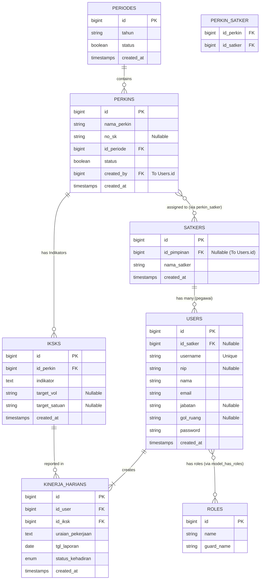

# Struktur Database Cakapku (ERD)

Di bawah ini merupakan ilustrasi keterkaitan (*Entity-Relationship Diagram*) seluruh tabel di dalam _Database_ Cakapku beserta integrasi _role_ menggunakan `spatie/laravel-permission`:

## Keterangan Singkat:
1. **Users dengan Roles**: Telah didukung oleh pustaka `spatie`, sehingga peran `ADMIN`, `PIMPINAN`, dll melekat secara terpisah via tabel pivot di balik layar.
2. **Perkin_Satker**: Tabel jembatan (*pivot table*) yang membuat satu dokumen Perkin (Perjanjian Kinerja) bisa didistribusikan ke banyak Unit Satker sekaligus.
3. **Users (Struktur Baru)**: Penambahan atribut Username opsional seperti `username` dan kolom `nip` digunakan untuk otentikasi login multi-kolom yang dinamis.
